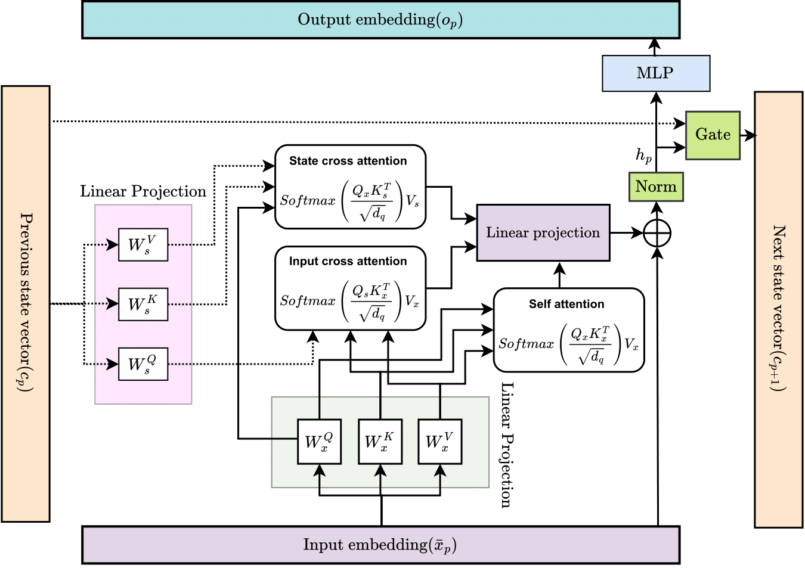

# ARNN: Attentive Recurrent Neural Network for Multi-channel EEG Signals to Identify Epileptic Seizures


By [Salim Rukhsar<sup>[1]</sup><span>&#42;</span>](https://www.linkedin.com/in/salim-rukhsar-10845282/),
[Anil K. Tiwari<sup>[1]</sup><span>&#42;</span>](http://home.iitj.ac.in/~akt/),

Paper Link: [ARNN: Attentive Recurrent Neural Network for Multi-channel EEG Signals to Identify Epileptic Seizures](https://arxiv.org/abs/2403.03276)

In association with Image Processing and Computer Vision Lab @ Indian Institute of Technology jodhpur<sup>[1]</sup>.

ABSTRACT: We proposed an Attentive Recurrent Neural Network (ARNN), which recurrently applies attention layers along a sequence and has linear complexity with respect to the sequence length. The proposed model operates on multi-channel EEG signals rather than single channel signals and leverages parallel computation. In this cell, the attention layer is a computational unit that efficiently
applies self-attention and cross-attention mechanisms to compute a recurrent function over a wide number of state vectors and input signals. Our architecture is inspired in part by the attention layer and long short-term memory (LSTM) cells, and it uses long-short style gates, but it scales this typical cell up by several orders to parallelize for multi-channel EEG signals. It inherits the
advantages of attention layers and LSTM gate while avoiding their respective drawbacks. We evaluated the model’s effectiveness through extensive experiments with heterogeneous datasets, including the CHB-MIT and UPenn and Mayo’s Clinic, CHB-MIT datasets. The empirical findings indicate that the ARNN model exhibits enhanced performance compared to the baseline methods LSTM, Vision Transformer (ViT), Compact Convolution Transformer (CCT), and R-Transformer (RT) model and demonstrates faster processing capabilities across the majority of tasks. 

## Usage
Our repository is arranged as follows:
```
[Task Name] /
    data/ # contains the datasets {needs to be downloaded}
    experiment.py #run experiment for ARNN
    Exp_model.py # run the experiment for baseline model
    model.py # comtains the model
models /
    # Contains the ARNN and others baseline models    
```
The preprocessed CHB-MIT dataset can be downloaded from [pre-processed CHM-MIT](https://ieee-dataport.org/open-access/preprocessed-chb-mit-scalp-eeg-database), and the UPenn and Mayo's Clinic Seizure Detection Challenge dataset from [Upen nad Mayo](https://www.kaggle.com/c/seizure-detection). Subsequently, place it within the 'data' directory, ensuring that the directory is created beforehand..

Once the data is prepared, the code is compatible for direct execution with Torch version==2.1.2.
## Final Words
We aim to maintain this repository with regular updates, aspiring for its relevance and practicality in supporting your research endeavors. 
